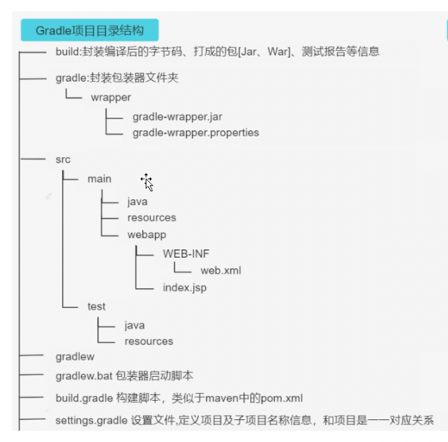
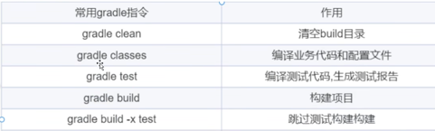
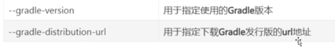
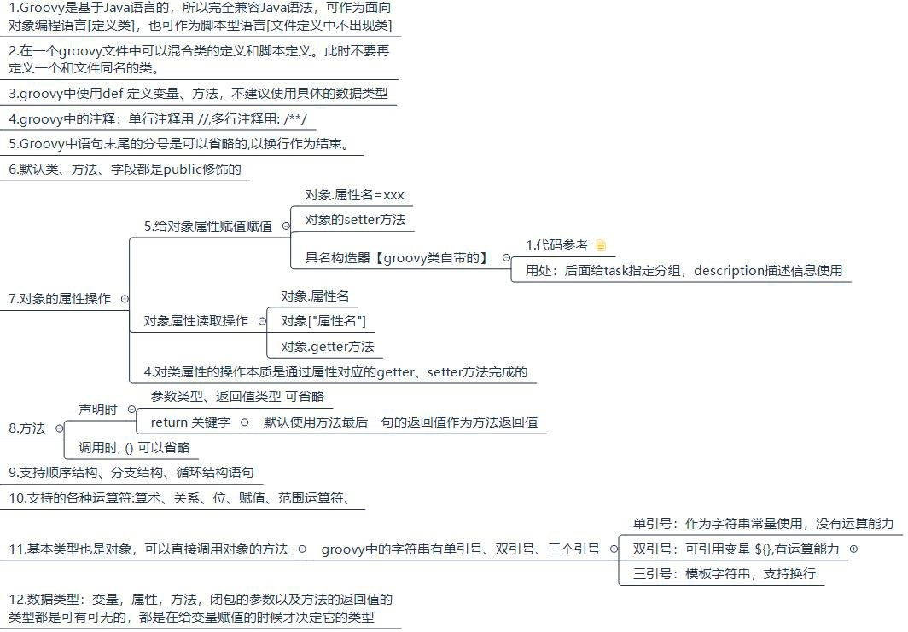
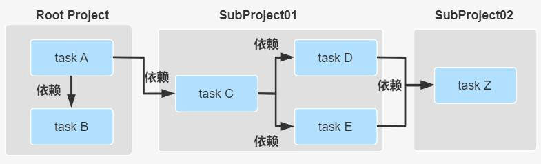
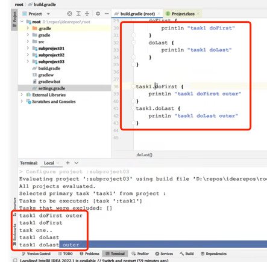
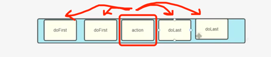
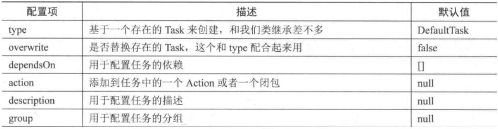
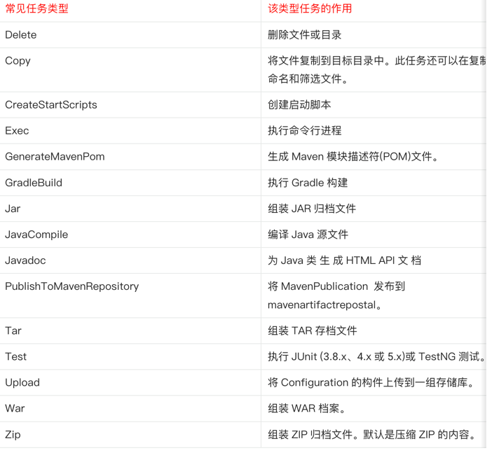

- 课程链接：https://www.bilibili.com/video/BV1yT41137Y7?p=7&spm_id_from=pageDriver&vd_source=b4d4dcdd240550164a1db69bbd9cf4ba
- 课程笔记：https://www.yuque.com/docs/share/f7487dc8-743d-43ba-8585-a0f85f12d826
@[toc]
## Gradle基本介绍
### 一、Gradle 工程结构

1. 每个project都有一个build.gradle文件
2. 很多个project，只有一个settings.gradle文件
3. gradlew和gradlew.bat执行的是wrapper的命令，并不是本地gradle命令
***
### 二、创建一个Gradle项目
- 方法一：idea创建
- 方法二：命令行 gradle init
***
### 三、Gradle常用指令
在含有build.gradle文件下的地方执行

1.  build文件夹下，含有测试报告  
2. gradle classes指令生成build目录下classes文件
3. gradle build 等于执行了前面的gradle test+gradle classes(编译+测试+打包)
***
### 四、wrapper
- 作用：解决不同版本gradle(取决于idea版本)
- 执行命令：用gradlew(常用指令和gradle一样)
- 用gradle命令，用的是本地的gradle  
- 

***
***
## Gradle与Idea整合
### 一、Groovy基本语法

### 二、Gradle创建java工程
1. 创建后自动执行的是wrapper文件配置  
换成本机：在settings里设置gradle user home
### 三、Gradle创建web工程
1. 先创建java工程
2. 新增war插件  plugin id "war"
3. 修改build.gradle的dependencies
4. 在main中添加webapp文件夹
5. 把resource配置好
***

## 项目的生命周期（**文件执行顺序**）
Initialization -> Configuration -> Execution
1. Initialization初始化：主要目的是初始化构建, 它又分为两个子过程,一个是执行 Init Script,另一个是执行 Setting Script。  
   (先执行**️init.gradle**，在执行**setttings.gradle**(记录当前项目名字)文件)
2. Configuration配置:执行**build.gradle**文件，根据脚本代码**创建对应的 task**。最终根据所有 task 生成由 Task 组成的有向无环图  

3. Execution执行：根据上面的有向无环图，有序**执行tasks**
***
## settings文件
- 作用：在初始化阶段，确定哪些工程要构建，为建立tree作准备
- 内容：里面主要定义了当前 gradle 项目及子 project 的**项目名称**
- 位置：必须放在根工程目录下(根=主)
- 对应实例：与 org.gradle.api.initialization.Settings 实例是一一对应的关系。每个项目只有一个settings 文件。
```
//根工程项目名
rootProject.name = 'root'
//包含的子工程名称
include 'subject01' 
include 'subject02' 
include 'subject03'
//包含的子工程下的子工程名称
include 'subject01:subproject011' 
include 'subject01:subproject012'
```
***
## Gradle的tasks
### Tasks（写在build.gradle文件里）
- 定义：一个 Task 表示一个逻辑上较为**独立的执行过程**，比如编译Java 源代码，拷贝文件， 打包Jar 文件，甚至可以是执行一个系统命令。  
### 一、task的配置、行为、执行顺序
```
gradle -i 任务名
```
```
task A {

    //任务配置：在配置阶段执行
    println "root taskA" 
    
    //任务行为：在执行阶段进行
    doFirst(){
        println "root taskA doFirst"
    }
    doLast(){
        println "root taskA doLast"
    }
}
```
- 任务配置：
- 任务行为：可在内部or外部定义
```
def map=new HashMap<String,Object>();

//action属性可以设置为闭包，设置task自身的行为
map.put("action",{println "taskOne"})

task(map,"taskOne"){
    description   'taskA description	'
    group "atguigu"
    
    
    //在task内部定义doFirst、doLast行为
    doFirst {
        def name = 'doFirst..' 
        println name
    }
    doLast {
        def name = 'doLast..' 
        println name
    }
}


//在task外部定义doFirst、doLast行为
a.doFirst {
    println it.description
}
a.doLast {
    println it.group
}

```
- 执行顺序结果：

- 执行顺序解析：
  
先有一个action，每添加一个do first，就在action**前**加do first,因此最后添加的first 最**先**执行。
每添加一个do last，就在action后面加do last,因此最后添加的first 最**后**执行。
### 二、task之间的依赖
1. 参数依赖
```
task A {
    doLast {
        println "TaskA.."
    }
}
task 'B' {
    doLast {
        println "TaskB.."
    }
}

//参数方式依赖: dependsOn后面用冒号
task 'C'(dependsOn: ['A', 'B']) {
    doLast {
        println "TaskC.."
    }
}}
```
2. 内部依赖
```
//参数方式依赖
task 'C' {
    //内部依赖：dependsOn后面用 = 号
    dependsOn= [A,B] 
    doLast {
        println "TaskC.."
    }
}
```
3. 外部依赖
```
C.dependsOn(B,'A')
```
4. 可以跨文件依赖
### 三、任务执行语句
| 分类          | 解释                                                                   |
|-------------|----------------------------------------------------------------------|
| 常见的任务（*）    | gradle build: 构建项目:编译、测试、打包等操作                                       |
| ----------- | gradle run :运行一个服务,需要application 插件支持，并且指定了主启动类才能运行                  |
| ----------- | gradle clean: 请求当前项目的 build 目录                                       |
| ----------- | gradle init : 初始化 gradle 项目使用                                        |
| ----------- | gradle wrapper:生成wrapper 文件夹的。                                       |
| ----------- | gradle wrapper 升级wrapper 版本号：gradle wrapper --gradle-version=4.4     |
| ----------- | gradle wrapper --gradle-version 5.2.1 --distribution-type all :关联源码用 ||
| 等等          | https://www.yuque.com/youyi-ai1ik/emphm9/kyhenl?inner=FuDzl          |     |

### 四、定义任务、属性
1. 方法一：通过 Project 中的task()方法
```
task('A',{
   //任务名称,闭包都作为参数
   println "taskA..."
})
task('B'){
   //闭包作为最后一个参数可以直接从括号中拿出来
   println "taskB..."
}
task C{
   //groovy语法支持省略方法括号:上面三种本质是一种
   println "taskC..."
}

```
2. 方法二：通过tasks 对象的 create 或者register 方法。
```
def map=new HashMap<String,Object>(); map.put("action",{println "taskD.."}) //action属性可以设置为闭包task(map,"D");

tasks.create('E'){
   //使用tasks的create方法
   println "taskE.."
}

tasks.register('f'){ 
   //注：register执行的是延迟创建。也即只有当task被需要使用的时候才会被创建。
   println "taskF	"
}
```
3. 任务属性

### 五、现成的任务类型

### 六、任务的执行顺序
1. 法一：dependsOn 强依赖方式
2. 法二：通过 Task 输入输出
3. 法三：通过 API 指定执行顺序
***
## Gradle文件操作(写在build.gradle里）
### 一、本地文件
```
   //使用相对路径
   File configFile = file('src/conf.xml')
   configFile.createNewFile();
   
   // 使用绝对路径
   configFile = file('D:\\conf.xml')
   println(configFile.createNewFile())
   
   // 使用一个文件对象
   configFile = new File('src/config.xml')
   println(configFile.exists())
```

### 二、文件集合
```
def collection = files('src/test1.txt',new File('src/test2.txt'),['src/test3.txt', 'src/test4.txt']) collection.forEach(){File it ->
   it.createNewFile() //创建该文件
   println it.name //输出文件名
   }

Set set1 = collection.files // 把文件集合转换为java中的Set类型
Set set2 = collection as Set

List list = collection as List//  把文件集合转换为java中的List类型
for (item in list) { println item.name
}

def union = collection + files('src/test5.txt') // 添加或者删除一个集合
def minus = collection - files('src/test3.txt') union.forEach(){File it ->
println it.name
}
```
### 三、文件树


