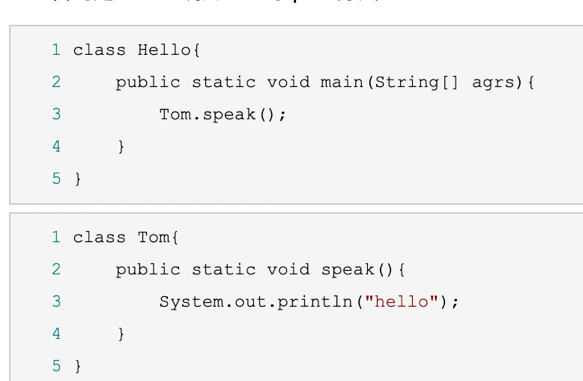

https://www.cnblogs.com/mq0036/p/8566427.html
## 一、只含有一个class文件的jar包
1. given: Hello.java的文件
2. **编译**:生成.class文件
```
javac Hello.java
```
3. **打jar包**：将.class打包成jar包
```
 jar -cvf hello.jar Hello.class 
```
- c表示要创建一个新的jar包
- v表示创建的过程中在控制台输出创建过程的一些信息
- f表示给生成的jar包命名
4. **添加main属性** 
- 打开jar包，打开META_INF/MENIFIEST.MF
- 最后一行添加
```
Main-Class: Hello
```
4. **运行jar包**
```
 java -jar hello.jar
```
## 含有两个类的jar包
1. given

2. 编译： 
Hello.java和Tom.java同时被编译
```
javac Hello.java 
```
3. **添加main属性** 
```
1 Manifest-Version: 1.0
2 Created-By: 1.8.0_121 (Oracle Corporation)
3 Main-Class: Hello
```
4. **打jar包**
```
 jar -cvfm hello.jar META-INF\MENIFEST.MF Hello.class Tom.class 
```
## 有目录结构的jar包
1. given

2. 编译。。。。。
3. 打包 后面有com:表示把com这个文件夹下的所有文件都打进jar包
```
jar -cvfm hello.jar META-INF\MENIFEST.MF Hello.class com 
```
