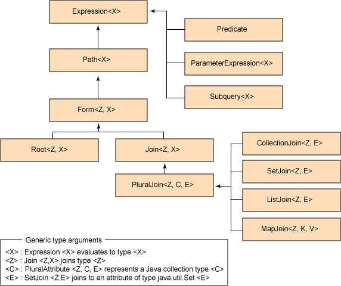
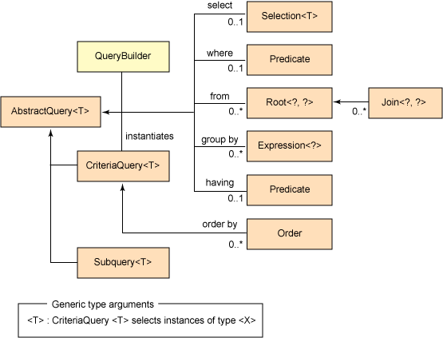

Optional 类,解决空指针异常，可以存null

Spring Data JPA Specifications:

findOne 查询结果不能返回超过一条，否则会抛出 IncorrectResultSizeDataAccessException。

# JPA复杂查询：利用JpaSpecificationExecutor
https://blog.csdn.net/yingxiake/article/details/51014223
## 1.首先接口继承于JpaSpecificationExecutor
```
    public interface TaskDao extends JpaSpecificationExecutor<Task>{
    
    }
```
## 2.JpaSpecificationExecutor提供了以下接口
```
public interface JpaSpecificationExecutor<T> {

    T findOne(Specification<T> spec);

    List<T> findAll(Specification<T> spec);

    Page<T> findAll(Specification<T> spec, Pageable pageable);

    List<T> findAll(Specification<T> spec, Sort sort);

    long count(Specification<T> spec);
}
```
Specification<T> 接口
```

public interface Specification<T> {

    Predicate toPredicate(Root<T> root, CriteriaQuery<?> query, CriteriaBuilder cb);
}

```
# Criteria API 还提供一个能够在运行时动态地构建查询的机制。
```
//获取一个 EntityManager 实例。
//EntityManager 创建 QueryBuilder 的一个实例。QueryBuilder 是 CriteriaQuery 的工厂。

EntityManager em = ...

//CriteriaQuery 被赋予泛型类型。泛型参数声明 CriteriaQuery 在执行时返回的结果的类型。
//在构造 CriteriaQuery 时，您可以提供各种结果类型参数 —— 从持久化实体（比如 Person.class）到形式更加灵活的 Object[]。

//QueryBuilder 工厂构造一个 CriteriaQuery 实例。
QueryBuilder qb = em.getQueryBuilder();

//在 CriteriaQuery 实例上设置了查询表达式。
CriteriaQuery< Person> c = qb.createQuery(Person.class);

//Root< T> 实际上表示：“对所有类型为 T 的实例计算这个查询。
Root< Person> p = c.from(Person.class);

//构造一个 Predicate。Predicate 是计算结果为 true 或 false 的常见查询表达式形式。
Predicate condition = qb.gt(p.get(Person_.age), 20);

//第 6 行在 CriteriaQuery 上将谓词设置为其 WHERE 子句。
c.where(condition);
TypedQuery< Person> q = em.createQuery(c); 
List< Person> result = q.getResultList();
```

 > Root< T> 实际上表示：“对所有类型为 T 的实例计算这个查询 ***相当于SQL from***  
 
CriteriaQuery 封装了传统查询的子句

